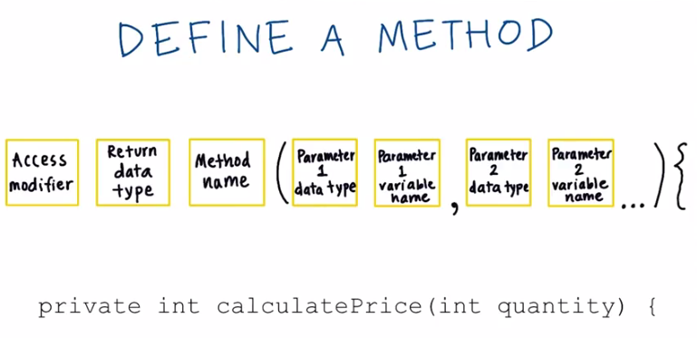

# 5. Functions
Created Monday 02 November 2020

*****

The visibility modifier comes after the access modifier.
For making a variadic function, use this syntax:
	public int variadicF(String ... children){}; // There can only be one variadic argument, and that too at last.

