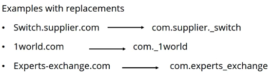
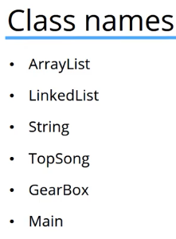
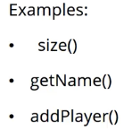
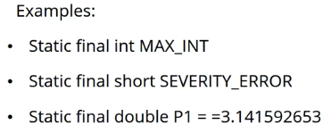
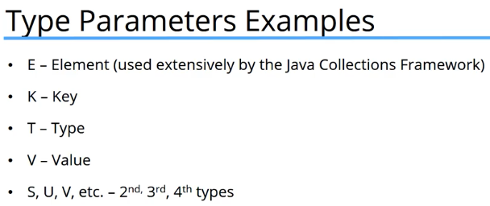

# 10. Naming Conventions and Packages
Created Sunday 09 August 2020

* Use conventions to make life easier for you and others.

Things to name:

1. Packages
	1. Lowercase
	2. Unique
	3. Replace invalid characters(like -) in a domain name should be replaced by an underscore.
	4. Domain starting with a number should starting with a number should have an underscore first.
	5. Domain name components that are Java keywords need to start with an underscores.

 

*****

2. Class Names
	1. camelCase
	2. Should be nouns(they represent things)
	3. Start with a capital letter

*****

3. Interface names
	1. Capitalized like class names(CamelCase)
	2. Consider what objects will be able to do once they implement

*****

4. Method names
	1. mixedCase
	2. Often verbs

*****

5. Constant names
	1. ALL UPPER_CASE
	2. Separate words using underscore

*****

6. Variable/field names
	1. mixed case
	2. Meaningful and indicative
	3. Start with a lower_case letter
	4. Do not use underscores

Examples:

* i
* league
* boxLength
* sydneySwans

*****

7. Type parameters
	1. Single letter
	2. Capital letter

