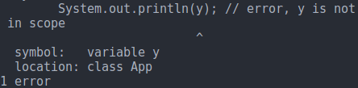
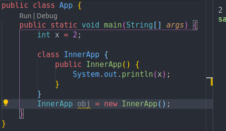

# 12. Scope
Created Sunday 09 August 2020

* Scores refers to the visibility of class member.

	public class X()
	{
		public int publicVar = 0;
	    private int privateVar = 1;
	}
	
	public class Main
	{
		public static void main(String[] args)
		{
			X obj = new X();
			System.out.println(X.publicVar);
			System.out.println(X.privateVar); // error here
		}
	}

* Top level classes can only be ``public`` or ``default``. Inner classes may be ``static``.
* Overshadowing is the same as in C++.
* Enclosing blocks work the same in Java as in C++, except that variables with the same name give an error.

	// function code
		int x = 2;
		{
			int x = 2; // duplication error
		}
	// function code
	
	// function code
		int x = 2;
		{
			int y = 2;
		}
		System.out.println(y); //error, y is not in scope
	// function code

* Scope involves inner classes too

