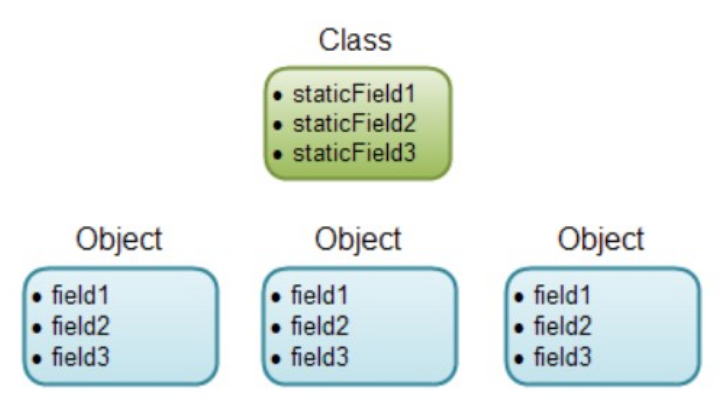

# 1. Static
Created Sunday 09 August 2020

When a number of objects are created from the same class blueprint, they each have their own distinct copies of *instance variables*.

But sometimes we want to have **variables** that are *common* to all objects, i.e there is only one chunk memory location associated with it, no matter how many(including zero) objects are created. 

* Variables are labelled *static* using the ``static`` modifier.

**Methods** can be ``static`` too, but they have a restriction: they cannot access fields of the [caller object](https://softwareengineering.stackexchange.com/questions/119924/is-there-an-alternative-to-the-term-calling-object).

#### Why the restriction for static methods?
The restriction exists because we can call ``static`` methods in two ways:

* With caller object. e.g ``obj.myStaticMethod();``, nothing weird here.
* Without a caller object, ``ClassName.myStaticMethod();`` - somewhat weird.

If we wish to accomodate both possibilities. We'd have to be OK with the fact that there may not be a caller object. Consequently, we must not work with field values and non-static methods. This is what Java does, which is also the norm in all programming languages, AFAIK.
It is enforced by restricting ``static`` methods access the ``this`` and ``super``.

Note:

* The restriction applies only to the caller object. We *can* work with other objects with no restrictions, viz arguments, local variables etc.

	class BiCycle()
	{
		public static void play(BiCycle b)
		{
			this.start(); // error
			this.speed = 23; // error
			
			b.start(); // absolutely fine - even if start() is a non-static method
			b.speed = 5; // OK
			
			BiCycle	p; // OK - We can create objects
			p.speed = 51; // OK
			p.start(); // OK
		}
	}
	

* Objects can freely access and manipulate ``static`` variables, w

ithout restrictions. An interestic application is to know the number of instances created, where we just increase count in the constructor.

#### Uses of static fields

* They can be used as a status indicators. i.e they'd work irrespective of the usage of the class.
* They are immensely helpful for storing relavant constants of the class, which we'd want only one occurence of in memory.

#### To sum up

* Static variables(aka class variables) - shared by all the instances.
* Static methods(aka class methods) are accessible by just using the className(OR an instance). They do not have access to **this** or **super**
* **Static fields do not need a instance for you to access them, although you can.**

*****

* The ``main`` function in a Java program is ``static`` it is called *first* by the JVM.

