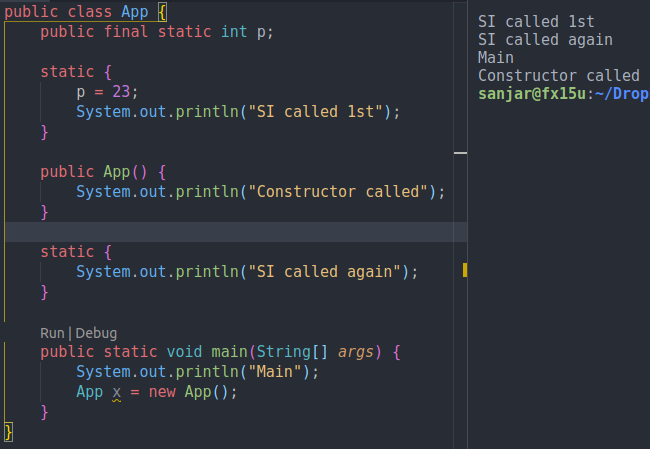

# 3. Static intialization blocks
Created Sunday 09 August 2020

* It runs when the class is loaded.

	public X{
		private static final p;
		static
		{
			System.out.println("Static intialization block called");
			p = 23;
		} 
		public X()
		{
		}
		
		static // we can have as many of these as we want
		{
			System.out.println("Static intialization block called");
		}
	}

* They are run before even before any static methods.
* We can have as many static init blocks as we want.

