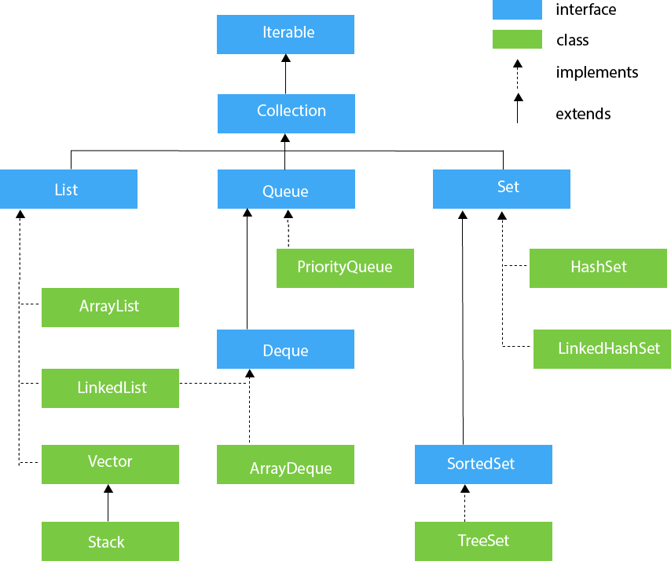

# 1. Monoitem - List, Queue and Set
Created Sunday 09 August 2020

* Vector vs ArrayList - vector is synchronized
* Priority queue does not allow null values to be stored.

*****

Sets
How are these different - the order of added items is different.

* HashSet - depends on hash value
* LinkedSet - insertion order
* TreeSet - ascending order

*****

Basic methods for the Collections contents(List, Queue, Set) interface:

1. **.add**(arg) - inserts the value, null is not allowed for ordered ones, for set no error for duplicate
2. **.remove**(arg) - removes the value
3. **.size**() - returns the number of items in the container
4. **.first**() - returns the first/lowest item
5. **.last**() - returns the last/highest item
6. **pollFirst**() - removes the first/lowest value
7. **pollLast**() - removes the last/highest value
8. **.clear**() - clears the whole container
9. To make a deep copy, pass the source container in the constructor

*****

Set operations

1. set1.**addAll**(set2) - does union and saves in set1
2. set1.**retainAll**(set2) - does intersection and saves in set2
3. set1.**containsAll**(set2) - checks if set1 is superset of set2 - returns boolean

