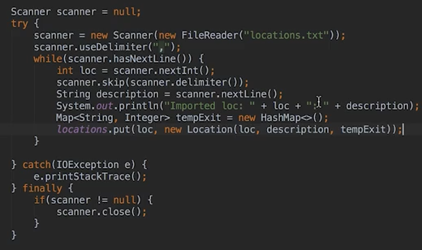

# 1. File readwrite
Created Tuesday 11 August 2020

**Reading**
	FileReader loc_file = null;
	try{
		Scanner loc_file = new FileReader("locations.txt");
		while(loc_file.ready())
			System.out.print((char)loc_file.read()); // character by character
	}
	catch(IOException e)
	{}
	finally{
		if(loc_file!=null)
			loc_file.close();
	}

**Read using scanner - provide the file as stream in scanner**
 

*****

**Writing**
	FileWriter loc_file = null;
	try{
		loc_file = new FileWriter("locations.txt");
		String[] messages = ["Get Here", "I'm good","Go east"];
		for(String msg: messages)
			loc_file.write(msg + "\n");
	}
	catch(IOException e)
	{}
	finally{
		if(loc_file!=null)
			loc_file.close();
	}

* new file locations.txt is created, or overwritten(if already existing)

	Get Here
	I'm good
	Go east

*****

New way to access files - Try resoruces block
	try(FileWriter loc_file = new FileWriter("locations.txt");
		FileWriter loc_file = new FileWriter("locations2.txt"))
	{
		String[] messages = ["Get Here", "I'm good","Go east"];
		for(String msg: messages)
			loc_file.write(msg + "\n");
	}
	catch(IOException e){}
	// file is automatically closed, null close exception, if there, is suppressed

