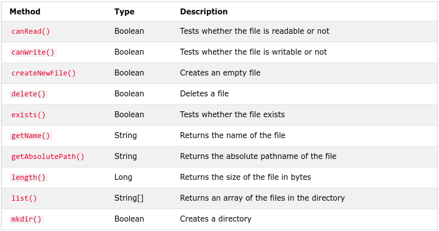

# 2. File Handling
Created Wednesday 12 August 2020

* provide the location/fileName in the File object.
* Relative locations also work in Java.
* There's nothing to close here.
* No support for symbolic links

	File myObj = new File("."); // providing location
	try {
		for (String p : myObj.list())
			System.out.println(p);
	} catch (Exception e) 
	{} finally {}

* write is available here

	File myObj = new File("myLoc.md"); // providing fileName
	try {
	    myObj.createNewFile(); // loc.txt will be created
	} catch (Exception e) {
	} finally {
	}

