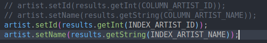
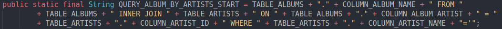

# 8. Using SQL in our code
Created Sunday 16 August 2020

* We are creating an API so that the application programmer does not need to think about database connections.
* This means we are never going to return SQL objects back to the main program, we'll be sending List etc. Only Java code is to be returned or null. 
* This also ensures that changing the database will have no effect on the application code.

*****

ResultSet - [Line 87 ../code/music_db/src/Datasource.java](./code/music_db/src/Datasource.java)

* To use ResultSet object, use .getInt(field_name or field_index). For string the syntax is:

	results.getString(index_name or index_field);
	

* We can use indexes or field names, indexes are more efficient, but the code will need to be changed if the table is altered. No change to the code is required if we use field names. **The method is overloaded. There's no pointer here, except for getting to the next record.**

* The index of the result is the result-based index, not database indexes. i.e the indexes will be according to the fields asked for. **Indexes start from 1 for SQL fields.**

*****

* There is no elegant way to create queryStrings, just by using the JDBC. 3rd party libraries might help here.
* We should create functions which our UI will most probably use.
* We can keep non-changing method queries as a static string, i.e not building them all the time.

