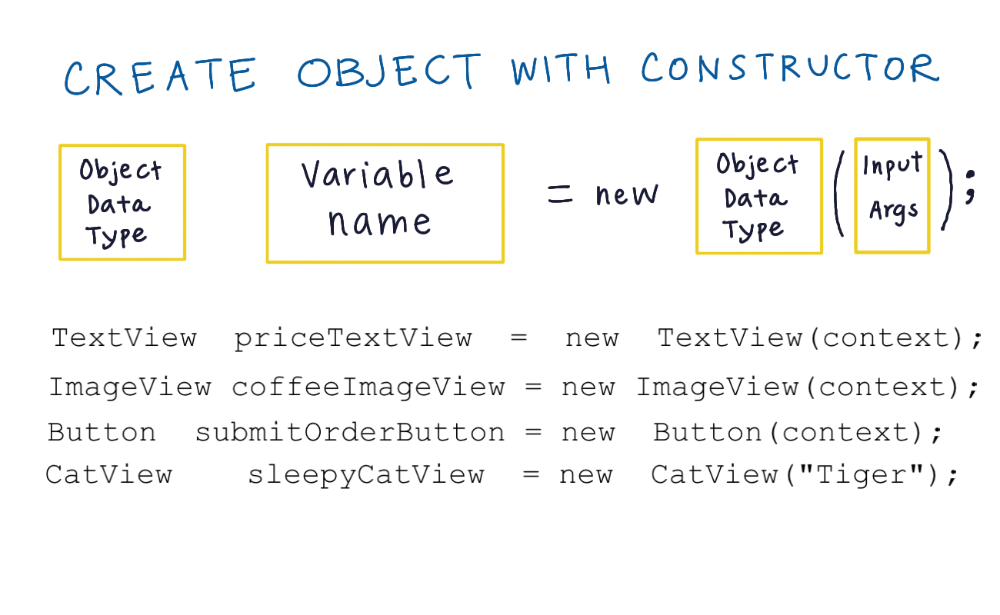
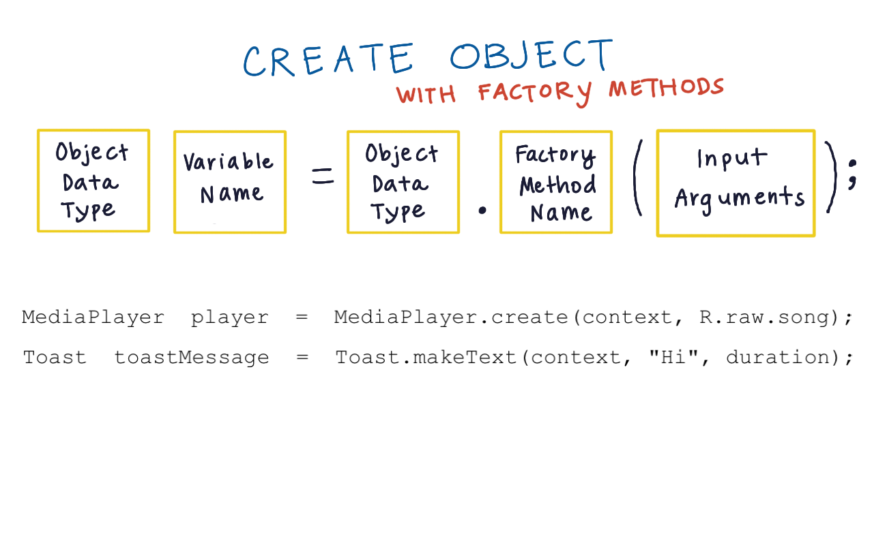
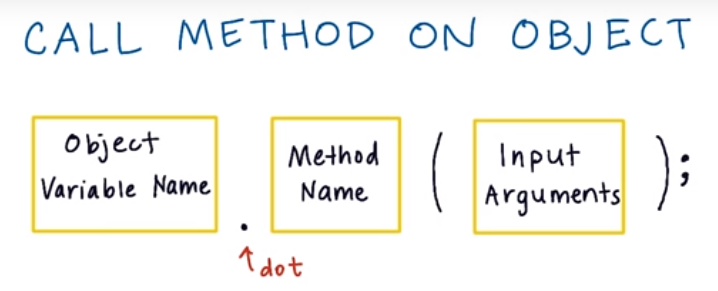

# 3. Creating objects
Created Tuesday 03 November 2020

#### Creating Objects

1. Using the constructor

2. Using a factory method

*****

Before making a new object, do a Google search to decide which constructor/factory method is best for object creation, based on context.

