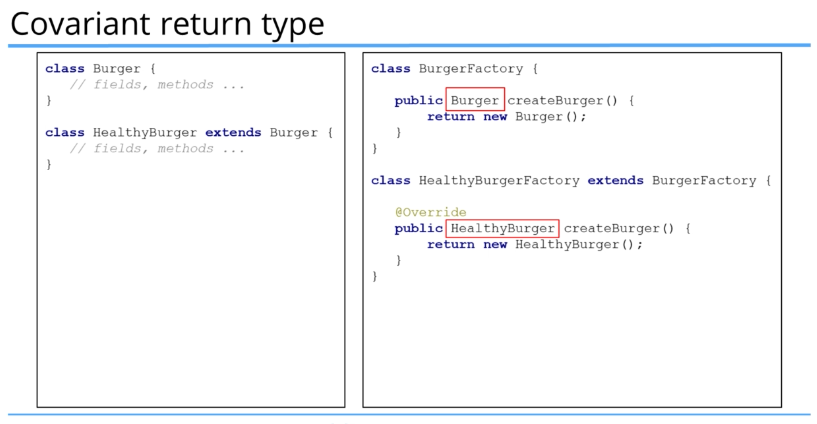
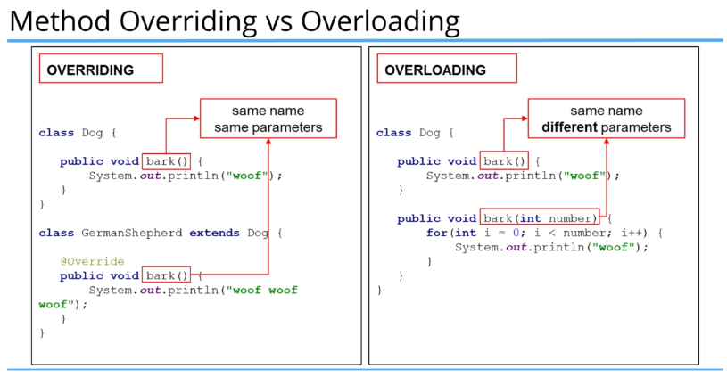

# 3. Method overloading vs overriding
Created Monday 03 August 2020

**Overloading**

* Method **overloading** means using the same name but with a different signature.
* It saves us the effort to remember different names.
* Overloading facilitates Compile Time Polymorphism. It doesn't have anything to do with polymorphism, technically.
* Overloading can be intra-class as well as amongst inherited subclasses.
* Return type are don't care.

*****

**Overriding**

* Method overriding means redfining a function from the parent class with the same signature.
* The two classes always have a IS-A relationship.
* Method overriding is also known as **Runtime polymorphism** or **Dynamic Method Dispatch**, because the method is decided at runtime by the JVM.
* When overriding, put a **Override** annotation. Cosmetic stuff for the 3rd party.

	@Override
	public void f()
	{
		// code
	}

* Constructor and private methods cannot be overriden.
* Methods that are final cannot be overriden. Like a version locking mechanism.
* A subclass can use (**super** or **this** both).methodName() to access the superclass version of the overriden method.
* Must have the same return type or some covariant return type.

*****

