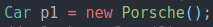
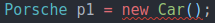

# 7. Inheritance Challenge 1
Created Monday 03 August 2020

Things learnt:

1. The last subclass has all the public and protected members accessible. Accumulation of inherited items does happen.
2. Java makes it very easy to do OOP.
3. As Inheritance is an IS-A relation, the new class(sub class) can be said to have the same covariant type as the parent class. **Very important - We can replace any subclass object by the parent class, but not vice versa.**

 Okay - can be used
 Error
[./inheritance_challenge/src/App.java](./7._Inheritance_Challenge_1/inheritance_challenge/src/App.java)

*****

How are conflics handled?

* Without using **this**, all variables/functions refer to those of the present level, not the ancestors.
* Ancesteral variables/functions are also available and accessible using super. i.e Accumulation is the norm.
* It is not possible to access an ancestors(i.e older than parent) state/methods. This is bad design and deliberately banned in Java.

*****

* Multiple inheritance is not possible using classes alone in Java. This is due to the diamond problems.
* Multiple inheritance is achieved indirectly using interfaces. This is because a class can inheritance from multiple interfaces.

