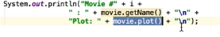

# 4. Polymorphism
Created Monday 03 August 2020

[./cinema/src](./4._Polymorphism/cinema/src)
The search and execution by the compiler for the correct function to be used for an object at hand during run time is called polymorphism.

* Here, the Forgetable movie had no plot(), so the compiler called the plot of the parent class, i.e Movie.plot() was called.
* This appropriation by the compiler, is in essence, polymorphism.
* Here, we do not specify which function(as in this or super or Movie), but it(JVM) did the appropriation.

	
Note: 

1. As inheritance is an IS-A relation, we can say the inherited ones are the same type as parent class. Used this in return Movie.
2. object.getClass().getSimpleName() can be used to get the class name(in non-static classes only).

*****

Challenge

