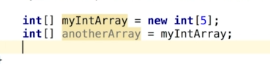
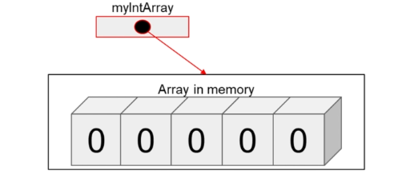
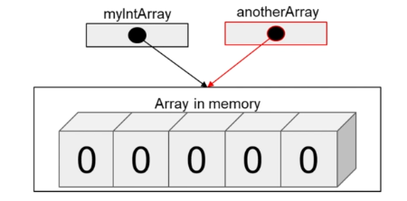

# 3. Reference vs Value types
Created Monday 03 August 2020

* All primitives are value types(deep copied on assignment).
* All non-primitives are reference types(shallow copy on assignment, they store the address in memory, which cannot be seen by us - no pointers).

*****

* String, Arrays are reference type.

Both hold the same address.

* How to know that a reference has been created: we did not use the new keyword, so no new object was created, this means only a reference was copied.
* Non-primitive types are passed by reference.

