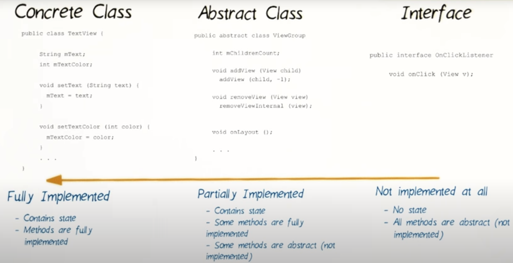
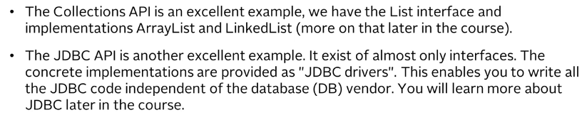

# 3. Abstract Class vs Interface
Created Saturday 08 August 2020

* Abstract class are similar to intefaces.
* They may contain a mix of implemented and unimplemented methods.
* Abstract classes cannot have both static and final fields.

**Use an abstract class when:**

1. We want to share code among related classes.
2. Classes which extend have many common methods or fields or require access modifiers other than public.
3. You want to declare non-static and/or non-final fields.
4. When the base class provides a default implementation of some method(s) for all the child classes.

**Summary**: The purpose of an Abstract class is to provide a common definition of a base class and has some methods to modify state of objects.
class that multiple derived classes can share.

*****

* Interfaces are just a contract between for a class, enforced at build time.
* All methods in an interface are automatically public and abstract.
* Interface can extend another interface.
* Interfaces are more flexible and can deal with a lot more stress on the design of the program's implementation.
* By using interfaces, we are make code more generic.

**Use an interface class when:**

1. Unrelated classes will implement the interface.
2. When behavior for a particular data type is to be specified, but who implements it does not matter.
3. When we need to seperate different behavior.

