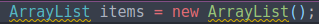
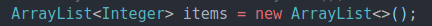
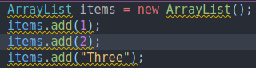
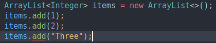

# 1. Introduction
Created Sunday 09 August 2020

* Don't use raw types. Like an ArrayList without data type specified.

* There's no need to specify data type on the constructor, if you've specified it in the LHS.

* We **could** mix types for raw ArrayList, but when we set it to <Integer> we **cannot** mix types anymore.

 
[./non-generic-code](./1._Introduction/non-generic-code)

